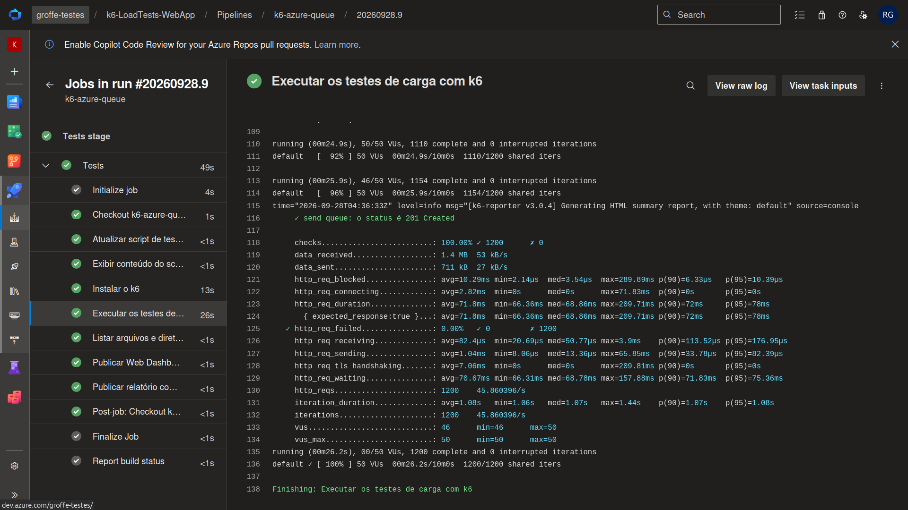
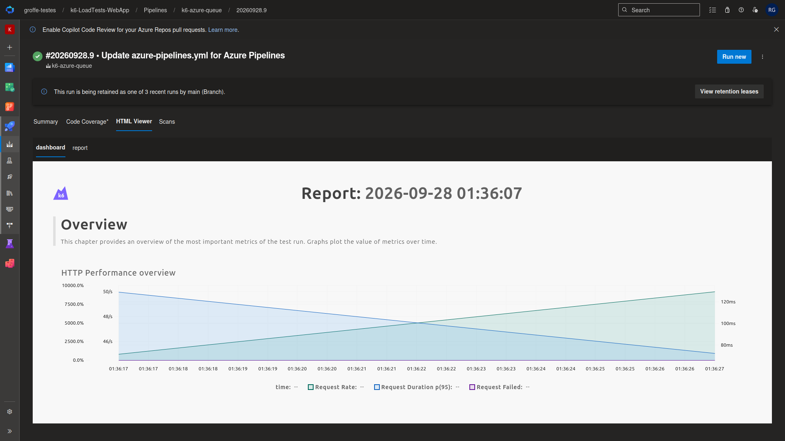
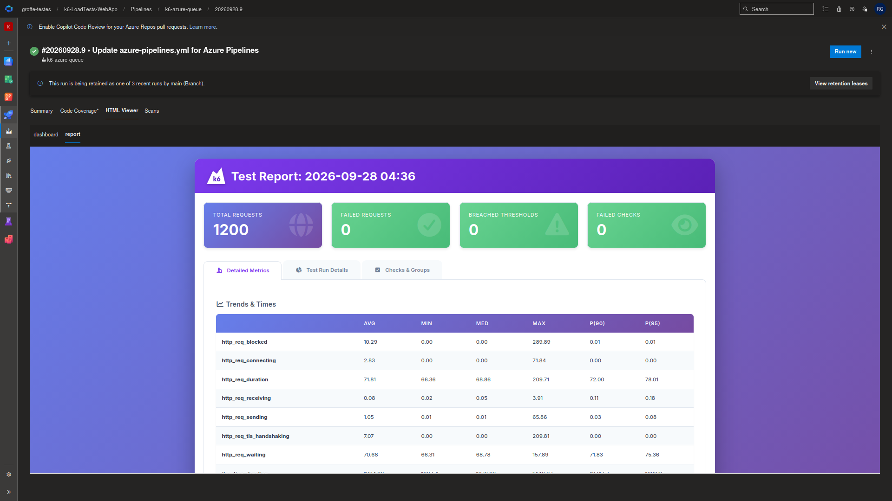

# k6-loadtests-azuredevops-azurequeuestorage-html-dashboard
Exemplo de pipeline do Azure DevOps para a execução automatizada de testes de carga do k6 em uma fila do Azure Queue Storage (com envio de mensagens via chamada HTTP), com thresholds + checks e a exportação dos resultados para relatórios HTML (Web Dashboard e HTML Reporter).

Aplicação utilizada nos testes: **https://github.com/renatogroffe/dotnet10-worker-azurequeuestorage_generic-consumer**

## Testes

Testes do k6 executados via pipeline:

Dashboard HTML do Grafana:

Reporter HTML do k6:

Extensão do Azure DevOps utilizada para publicação destes resultados: **https://marketplace.visualstudio.com/items?itemName=awardedsolutions.azure-pipelines-html-report-awardedsolutions**